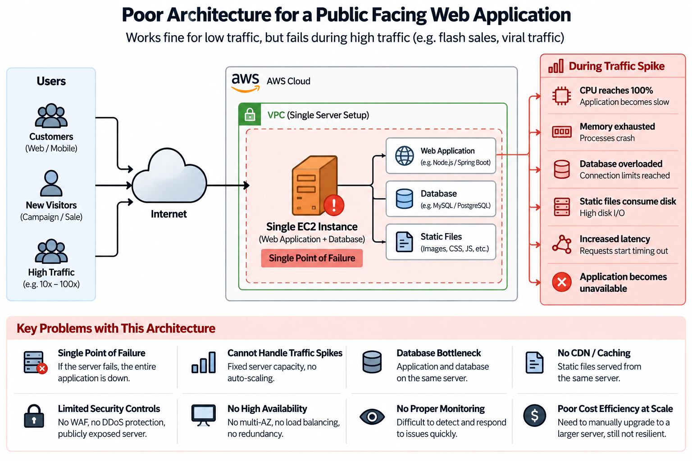

# Secure Elastic Web Architecture

> Designing a secure and scalable AWS architecture for public-facing applications experiencing sudden traffic spikes.

## Overview

Many small web applications work well under normal traffic but struggle when traffic suddenly increases because their architecture was designed around average demand rather than burst demand.

This project explores how a small application can evolve from a single-server architecture into a more elastic and security-focused AWS architecture.

---

## The Problem

A typical small application may begin with:

- A single compute instance
- Application and database on the same machine
- Static files served directly by the application
- Limited traffic protection
- Limited monitoring
- Fixed infrastructure capacity

This architecture can work for normal traffic but becomes a bottleneck during sudden traffic spikes.

### Example failure scenario

